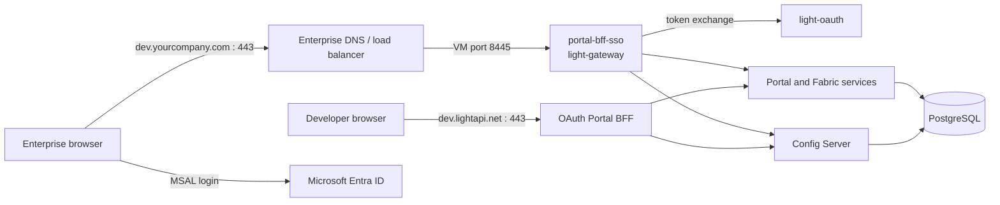
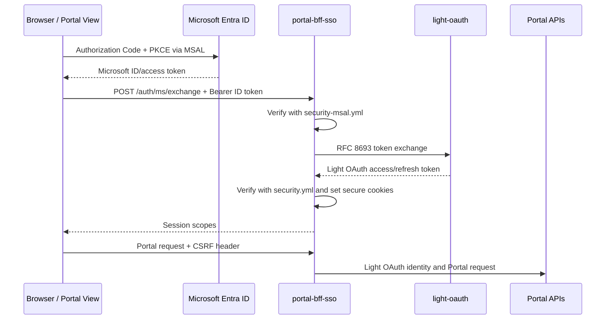
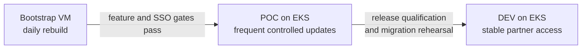

# portal-config-bootstrap

Linux VM bootstrap deployment for the Light Portal platform, its supporting
databases, Light Fabric services, and an enterprise Microsoft Entra SSO Portal
BFF based on `msal-exchange`.

This repository is intentionally separate from `portal-config-dev`:

- `portal-config-dev` remains the public OAuth 2.0 authorization-code reference.
- this repository can evolve enterprise DNS, certificates, secrets, SSO, data
  preservation, and AI-assisted operations without destabilizing public dev.
- the committed `portal-config-dev` stack is retained as the baseline; the
  enterprise differences live in `docker-compose.bootstrap.yml` and
  `portal-bff-sso/`.

The initial baseline was taken from committed `portal-config-dev` commit
`d597470ef0ae6ddf883d2fc88622cf1eb5431cf2`; see
[`UPSTREAM_BASELINE.md`](UPSTREAM_BASELINE.md). Local uncommitted changes in the
source checkout were not copied.

## Topology



The VM exposes the existing OAuth BFF on port `443` and the SSO BFF on port
`8445` by default. Enterprise DNS/load-balancing should terminate or forward
`https://dev.yourcompany.com:443` to the SSO listener. This avoids putting two
containers on the same host port and mirrors the host-routing boundary that
will later exist in EKS.

## Why a second BFF

Both BFFs use the same `light-gateway` image, but they are separate runtime
identities. The SSO BFF has its own:

- `(host, serviceId, envTag)` Config Server snapshot;
- `msal-exchange` handler chain and Microsoft token verifier;
- token-exchange confidential client;
- customer TLS certificate and host routing;
- config-cache volume; and
- Portal View artifact built with `VITE_SSO_ENABLED=true`.

This prevents redirect URIs, cookies, handlers, and client credentials from
being switched globally when testing OAuth and SSO side by side.

## Prerequisites

- Docker Engine with Compose v2
- `openssl`, Node.js, and npm
- sibling `portal-view` checkout (or set `PORTAL_VIEW_DIR`)
- Microsoft Entra SPA registration with the exact redirect URI
- Light OAuth client authorized for token exchange
- Portal bootstrap token scoped to the SSO BFF Config Server identity
- enterprise certificate for `dev.yourcompany.com` before shared use

## First-time setup

1. Create the private environment file:

   ```bash
   cp .env.bootstrap.example .env.bootstrap
   ```

   Replace every `replace-*` value. Do not commit this file.

2. Build the customer-specific SSO Portal View:

   ```bash
   ./scripts/build-portal-view-sso.sh
   ```

   `VITE_SSO_ENABLED`, tenant ID, client ID, and redirect URI are Vite
   build-time inputs. Changing them requires rebuilding the SPA.

3. Install enterprise TLS files as `portal-bff-sso/tls/ca.pem`, `cert.pem`, and
   `key.pem`. For single-user VM testing only, generate a self-signed set:

   ```bash
   ./scripts/generate-bootstrap-tls.sh
   ```

4. Create and publish the dedicated Config Server snapshot described in
   [`portal-bff-sso/config-server/README.md`](portal-bff-sso/config-server/README.md).
   Clone the working Portal BFF snapshot, preserve all Portal routes, and change
   only the customer host and authentication chain.

5. Validate the repository and start the stack:

   ```bash
   ./scripts/validate-bootstrap.sh
   ./scripts/restart-bootstrap-stack.sh
   ```

For an initial database recreation from the current CDN baseline:

```bash
./scripts/restart-bootstrap-stack.sh --recreate-database
```

The recreation command verifies the signed `events.zip` with the pinned
Ed25519 public key in `release-keys/<keyId>.pem` before extracting `events.json`
or stopping the existing database. The repository ships the current release
key. A controlled deployment may set `EVENT_BUNDLE_KEY_DIR` to another
independently provisioned trust directory. Never download the trusted key from
the same CDN location as the bundle it verifies. The extracted editable JSON
records the verified archive digest in
`data/events.json.source-bundle.sha256`; a later import fails if the adjacent
archive no longer matches that marker.

The inherited recreation path moves the old PostgreSQL data directory to a
timestamped backup before rebuilding it. Until the host-scoped export/import
workflow below is automated and qualified, do not schedule this command on a
VM containing customer-created entities.

## MSAL exchange flow



`security-msal.yml` validates the incoming Microsoft token. The normal
`security.yml` remains mandatory because it validates the Light OAuth token
returned by the exchange and used for Portal authorization and custom claims.

## Daily bootstrap lifecycle

The target lifecycle is documented in
[`docs/bootstrap-data-lifecycle.md`](docs/bootstrap-data-lifecycle.md). Its
central rule is: export only the customer host from the global export, verify
the artifact, rebuild global and `dev.lightapi.net` from the published
`events.json`, then import the customer host and wait for projections before
declaring the stack ready.

The repository currently provides the recoverable baseline recreation and the
SSO deployment scaffold. Host-scoped export/import automation is deliberately
not faked: it must be wired to the qualified Portal export contract and tested
with aggregate-version, dependency, and projection-readiness checks before a
daily timer is enabled.

## Environment promotion



- **Bootstrap** is disposable and optimized for integration feedback.
- **POC** is the first official EKS deployment and changes through a controlled
  promotion, not an automatic daily rebuild.
- **DEV** is partner-facing. Every release requires forward data migration,
  rollback evidence, and retained customer data.

## Repository layout

| Path | Purpose |
| --- | --- |
| `docker-compose.yml` | Committed public-dev baseline stack |
| `docker-compose.bootstrap.yml` | Bootstrap overlay and dedicated SSO BFF |
| `.env.bootstrap.example` | Non-secret environment contract |
| `portal-bff-sso/config/` | Local startup identity and runtime overrides |
| `portal-bff-sso/config-server/` | Reviewable MSAL snapshot source/fragments |
| `portal-bff-sso/lightapi/dist/` | Ignored customer-specific SPA build |
| `portal-bff-sso/tls/` | Ignored enterprise or local-development TLS |
| `scripts/` | Build, validation, database, and stack lifecycle tooling |

## Security boundaries

- Never commit `.env.bootstrap`, private keys, tokens, client secrets, exported
  customer data, or AI session transcripts.
- The copied public-dev baseline still contains development-only database
  passwords, certificates, and bootstrap token defaults. Treat these as local
  compatibility fixtures and replace them before any shared enterprise use.
- Use an enterprise secret manager for POC/DEV; the local env file is a VM
  bootstrap convenience only.
- Give AI tooling read-only Kubernetes, source, log, and database access by
  default. Deployment or database writes require an approved workflow with an
  audit trail.
- Replace self-signed certificates and disabled hostname verification before
  promoting beyond a single-user Bootstrap VM.
