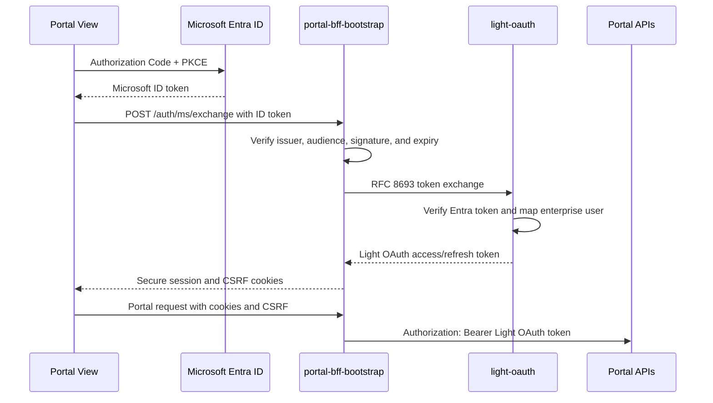
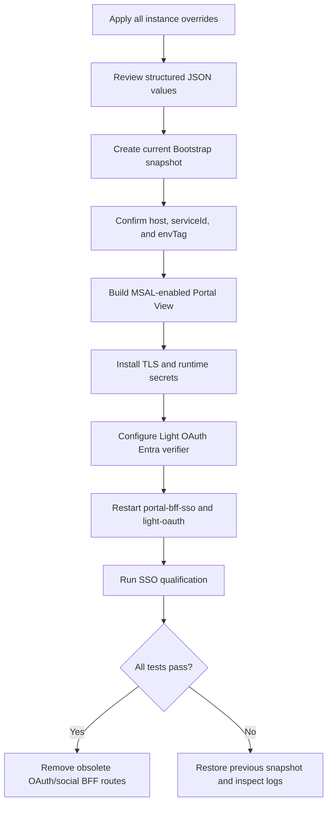

# Bootstrap Portal BFF configuration

This document records the configuration state and required changes for the
`portal-bff-bootstrap` instance cloned from `portal-bff-dev`.

Last verified: **2026-08-30 America/Toronto** against the local Bootstrap
PostgreSQL projections and current Config Server snapshot.

## Status summary

| Area | Status | Notes |
| --- | --- | --- |
| Instance clone | Complete | `portal-bff-bootstrap` exists and is active/current. |
| Initial snapshot | Complete | The clone created a current snapshot for `envTag=bootstrap`. |
| Cloned properties | Complete | 54 active instance properties were copied from `portal-bff-dev`. |
| `msal-exchange` handler | Not applied | `handler.handlers`, `handler.chains`, and `handler.paths` contain no `msal-exchange`. |
| `msal-exchange` properties | Not applied | No instance overrides exist for this configuration. |
| `security-msal` properties | Not applied | No instance overrides exist for this configuration. |
| Confidential Light OAuth client | Not created/verified | A client with `tokenExType=msal` is required. |
| Microsoft JWKS in Light OAuth | Not applied/verified | Light OAuth must independently validate the Entra token. |
| SSO Portal View build | Not applied/verified | Requires an MSAL-enabled build with `/redirect`. |
| Post-change snapshot | Not created | Create this only after all instance overrides are reviewed. |

## Current cloned identity

The live projected instance currently has this identity:

```yaml
configHost: dev.lightapi.net
instanceName: portal-bff-bootstrap
instanceId: f43b90c0-f2f6-500f-a09c-04723cdb2f54
serviceId: com.networknt.portal.gateway-1.0.0
environment: dev
envTag: bootstrap
current: true
active: true
```

The current clone snapshot is:

```yaml
snapshotId: fd1684ef-131d-58ec-895c-39b894e9f64d
snapshotTimestamp: 2026-08-31T01:24:01.959976Z
serviceId: com.networknt.portal.gateway-1.0.0
envTag: bootstrap
current: true
```

The running Bootstrap BFF must request the exact Config Server tuple:

```text
(host=dev.lightapi.net,
 serviceId=com.networknt.portal.gateway-1.0.0,
 envTag=bootstrap)
```

The public browser hostname may still be `dev.yourcompany.com`. The Config
Server host selects the Portal configuration tenancy; it does not have to equal
the public DNS name. If the BFF must eventually belong to the customer-host
export boundary, promote or recreate it under the `dev.yourcompany.com` Portal
host because Instance Clone is a same-host operation.

## Changes introduced by the clone

The clone made these changes relative to `portal-bff-dev`:

| Field | Source | Bootstrap clone |
| --- | --- | --- |
| Instance name | `portal-bff-dev` | `portal-bff-bootstrap` |
| Instance ID | `019d2a45-4eb7-7e20-a6b6-9cc3261e89a1` | `f43b90c0-f2f6-500f-a09c-04723cdb2f54` |
| Environment tag | `dev` | `bootstrap` |
| Config snapshot | Existing dev history | New current Bootstrap snapshot |

The service ID, logical configuration host, product version, environment, and
all 54 active instance-property values remain inherited from the source.

In particular, the clone still uses:

- the `stateless` OAuth authorization-code handler;
- the inherited OAuth/social handler chains and endpoints;
- the inherited client credentials and redirect URI;
- the inherited `dev.lightapi.net` cookie and WebSocket settings; and
- the inherited local virtual hosts and CORS origins.

## Target authentication flow



The BFF uses `security-msal` to validate the incoming Microsoft token and the
normal `security` configuration to validate the exchanged Light OAuth token.

## Portal configuration procedure

In Portal View:

1. Open **Instance Admin**.
2. Find `portal-bff-bootstrap`.
3. Select the row action **Config**.
4. Select **Update Config Values**.
5. Confirm the scope is **Instance** and the target instance is
   `portal-bff-bootstrap`.
6. Leave **Overridden only** disabled so inherited catalog properties are
   visible.
7. Apply and review the changes below.
8. Return to Instance Admin, select **Snapshot**, and create a new current
   snapshot only after the complete change set is ready.

## Required `handler` changes

### `handlers`

Add `msal-exchange` to the existing array:

```json
"msal-exchange"
```

During initial testing, retain the old handler IDs to make rollback easier.
After SSO qualification, remove the unused browser-auth handlers:

```json
"stateless",
"google",
"facebook",
"github"
```

### `chains`

Preserve the existing `admin`, `code`, and `mcpChain` definitions. Replace
`stateless` in the browser-facing chains and add a dedicated endpoint chain:

```json
{
  "default": [
    "exception",
    "limit",
    "correlation",
    "cors",
    "msal-exchange",
    "header",
    "prefix",
    "token",
    "router"
  ],
  "hybrid": [
    "exception",
    "limit",
    "correlation",
    "cors",
    "msal-exchange",
    "header",
    "prefix",
    "token",
    "access-control",
    "router"
  ],
  "chat": [
    "exception",
    "msal-exchange",
    "security",
    "websocket"
  ],
  "msalAuth": [
    "exception",
    "correlation",
    "cors",
    "msal-exchange"
  ]
}
```

The structured value saved in Portal must remain the complete `chains` object,
not only this changed subset.

### `paths`

Add these four entries to the complete existing path array:

```json
[
  {
    "path": "/auth/ms/exchange",
    "method": "POST",
    "exec": ["msalAuth"]
  },
  {
    "path": "/auth/ms/exchange",
    "method": "OPTIONS",
    "exec": ["msalAuth"]
  },
  {
    "path": "/auth/ms/logout",
    "method": "POST",
    "exec": ["msalAuth"]
  },
  {
    "path": "/auth/ms/logout",
    "method": "OPTIONS",
    "exec": ["msalAuth"]
  }
]
```

Keep `cors` before `msal-exchange`. After SSO is qualified, remove these old
browser-auth routes:

```text
GET     /authorization
POST    /logout
OPTIONS /logout
GET     /google
GET     /facebook
GET     /github
```

Retain `/oauth2/{hostId}/...` because those paths expose Light OAuth operations
used by the platform.

## Required `msal-exchange` overrides

| Property | Target value |
| --- | --- |
| `enabled` | `true` |
| `exchangePath` | `/auth/ms/exchange` |
| `logoutPath` | `/auth/ms/logout` |
| `cookieDomain` | `dev.yourcompany.com` |
| `cookiePath` | `/` |
| `cookieSecure` | `true` |
| `cookieSameSite` | `Lax` |
| `sessionTimeout` | `3600` |
| `rememberMeTimeout` | `604800` |
| `renewBeforeSeconds` | `90` |
| `refreshSingleFlightWaitMs` | `5000` |
| `refreshSingleFlightCacheMs` | `3000` |
| `refreshSingleFlightMaxEntries` | `10000` |
| `cookieTimeoutUri` | `/` |
| `subjectTokenType` | `urn:ietf:params:oauth:token-type:jwt` |
| `authorizationToken` | `light-oauth` |
| `lightTokenHeader` | `X-Light-Token` |
| `msalAccessTokenHeader` | `X-MSAL-Access-Token` |
| `msalAccessTokenCookie` | `msalAccessToken` |

Use `SameSite=Lax` for the intended same-site Portal/BFF deployment. Change it
to `None` only when a tested cross-site browser flow requires it.

## Required `security-msal` overrides

Replace `<tenant-id>` and `<entra-spa-client-id>` with the enterprise Entra
registration values.

| Property | Target value |
| --- | --- |
| `enableVerifyJwt` | `true` |
| `ignoreJwtExpiry` | `false` |
| `enableRelaxedKeyValidation` | `false` |
| `issuer` | `https://login.microsoftonline.com/<tenant-id>/v2.0` |
| `audience` | `<entra-spa-client-id>` |
| `jwt.clockSkewInSeconds` | `60` |

The audience is the Entra SPA/application audience in the ID token. It is not
the confidential Light OAuth token-exchange client ID.

## Required `client` overrides

Create a dedicated confidential Light OAuth client owned by
`portal-bff-bootstrap` with:

```text
scopes: portal.r portal.w
tokenExType: msal
```

Then configure:

| Property | Target value |
| --- | --- |
| `tokenServerUrl` | `https://light-oauth:6881` |
| `tokenExUri` | `/oauth2/AZZRJE52eXu3t1hseacnGQ/token` |
| `tokenExClientId` | `<confidential-light-oauth-client-id>` |
| `tokenExClientSecret` | Inject from the runtime secret environment |
| `tokenExScope` | `["portal.r","portal.w"]` |
| `subjectTokenType` | `urn:ietf:params:oauth:token-type:jwt` |
| `tokenRtUri` | `/oauth2/AZZRJE52eXu3t1hseacnGQ/token` |
| `tokenRtClientId` | `<confidential-light-oauth-client-id>` |
| `tokenRtClientSecret` | Inject from the runtime secret environment |
| `tokenRtScope` | `["portal.r","portal.w"]` |

Do not put the clear client secret into Portal events, snapshots, exports, or
Git. Supply the secret to the BFF container with the dotted runtime property
names:

```text
client.tokenExClientSecret
client.tokenRtClientSecret
```

Configure `tokenKeyServiceIdAuthServers` so both token issuers can be verified:

```json
{
  "com.networknt.light-oauth-1.0.0": {
    "server_url": "https://light-oauth:6881",
    "uri": "/oauth2/AZZRJE52eXu3t1hseacnGQ/keys",
    "enableHttp2": true
  },
  "microsoft-entra": {
    "server_url": "https://login.microsoftonline.com",
    "uri": "/<tenant-id>/discovery/v2.0/keys",
    "enableHttp2": true
  }
}
```

## Required browser-host overrides

Add the enterprise origin to `cors.allowedOrigins`:

```json
[
  "https://dev.yourcompany.com"
]
```

Retain local development origins only if they are still required.

Set `virtual-host.hosts` for the SSO Portal View:

```json
[
  {
    "domain": "dev.yourcompany.com",
    "path": "/",
    "base": "/lightapi/dist",
    "transferMinSize": 10245760,
    "directoryListingEnabled": false
  }
]
```

Set `websocket-router.originAllowlist`:

```json
{
  "/ctrl/mcp": [
    "https://dev.yourcompany.com"
  ]
}
```

Keep `websocket-router.pathPrefixService./ctrl/mcp.envTag=dev` until a separate
Bootstrap controller instance is intentionally introduced.

## Repository/runtime alignment

Until the instance is moved to the customer Portal host, the Bootstrap runtime
environment must select the current cloned identity:

```dotenv
CUSTOMER_PORTAL_HOST=dev.lightapi.net
PORTAL_BFF_SSO_SERVICE_ID=com.networknt.portal.gateway-1.0.0
PORTAL_BFF_SSO_ENVIRONMENT=bootstrap
```

The browser hostname remains a separate public-routing and cookie setting:

```text
dev.yourcompany.com
```

The Portal View MSAL build must use:

```dotenv
VITE_SSO_ENABLED=true
VITE_TENANT_ID=<tenant-id>
VITE_CLIENT_ID=<entra-spa-client-id>
VITE_REDIRECT_URI=https://dev.yourcompany.com/redirect
```

The redirect route is `/redirect`, not the old stateless-auth
`/authorization` route.

## Required Light OAuth deployment change

Light OAuth is a second verification boundary. Its runtime configuration must
independently validate the Microsoft token:

```yaml
msal_jwks_url: "https://login.microsoftonline.com/<tenant-id>/discovery/v2.0/keys"
msal_jwks_accept_invalid_certs: false
msal_jwt_expected_issuer: "https://login.microsoftonline.com/<tenant-id>/v2.0"
msal_jwt_expected_audience: "<entra-spa-client-id>"
```

This is a deployment-file change, not an Instance Admin override for the BFF.

## Snapshot and deployment sequence



For the first handler-chain transition, restart the BFF instead of relying only
on module reload. Confirm the runtime selected the new current Bootstrap
snapshot before beginning browser tests.

## Qualification checklist

- [ ] The BFF starts with `host=dev.lightapi.net`, the Portal gateway service
  ID, and `envTag=bootstrap`.
- [ ] `handler.yml` resolves `msal-exchange` in the default, hybrid, chat, and
  MSAL endpoint chains.
- [ ] Microsoft JWKS retrieval succeeds with hostname verification enabled.
- [ ] Light OAuth JWKS retrieval and exchanged-token verification still work.
- [ ] A valid Entra login calls `POST /auth/ms/exchange` successfully.
- [ ] The exchange response sets secure `accessToken`, `refreshToken` when
  issued, and `csrf` cookies.
- [ ] Portal query and command calls succeed with the CSRF header.
- [ ] `/ctrl/mcp` WebSocket admission accepts only the configured origin.
- [ ] `POST /auth/ms/logout` returns `204` and clears BFF cookies.
- [ ] Wrong issuer, wrong audience, expired tokens, and invalid signatures are
  rejected.
- [ ] Missing or incorrect token-exchange client credentials fail closed.
- [ ] No token, client secret, cookie value, or raw customer data appears in
  logs or committed files.
- [ ] The old `/authorization` and social login endpoints are removed after
  qualification.

## Change log

| Date | State | Change | Evidence |
| --- | --- | --- | --- |
| 2026-08-30 | Complete | Cloned `portal-bff-dev` to `portal-bff-bootstrap` on `dev.lightapi.net`. | Active projected instance with `envTag=bootstrap`. |
| 2026-08-30 | Complete | Created the initial current Bootstrap configuration snapshot. | Snapshot `fd1684ef-131d-58ec-895c-39b894e9f64d`. |
| 2026-08-30 | Verified pending | Compared the clone with the source instance. | 54 active overrides remain identical; no MSAL handler/config overrides exist. |
| Pending | Planned | Apply `handler`, `msal-exchange`, `security-msal`, client, host, CORS, and WebSocket overrides. | Record the resulting event/snapshot IDs here. |
| Pending | Planned | Build the SSO Portal View and configure Light OAuth Entra verification. | Record artifact digest and deployment version here. |
| Pending | Planned | Complete negative and positive SSO qualification. | Attach test evidence before POC promotion. |
