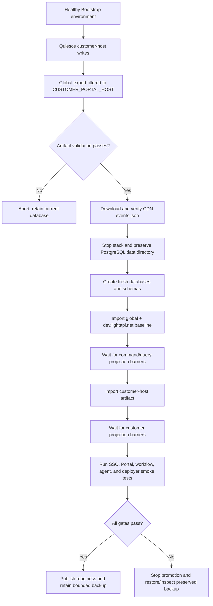

# Bootstrap data lifecycle

The Bootstrap database may be recreated daily only after the customer-host
preservation lane is qualified end to end.

## Required sequence

## Artifact contract

The host export must contain only the requested customer host plus every
dependency required to replay its entities. Validation must prove:

- the exported host equals `CUSTOMER_PORTAL_HOST`;
- no unrelated enterprise host is included;
- event IDs and aggregate IDs are unique;
- aggregate versions are contiguous for every stream;
- referenced parent/global entities are either in the baseline or included;
- the JSON checksum and event count are recorded; and
- secrets and operational evidence are excluded.

## Readiness contract

An importer exit code is not readiness. The daily job must wait until the
command log, Kafka/Debezium path, query projections, Config Server snapshots,
and Portal query results have reached the imported offsets. Only then may it
start the BFFs and application smoke tests.

## Retention and rollback

Keep the previous PostgreSQL data directory and the verified customer-host
export until the rebuilt environment passes all gates. Use bounded retention
and encrypt backups at rest. A failed rebuild must never overwrite the last
known-good export.

## Promotion policy

The daily job applies only to Bootstrap. POC receives an explicitly selected
and tested release. DEV requires an additive migration or a rehearsed
export/replay migration with rollback evidence; it is never destructively
recreated as part of normal deployment.
